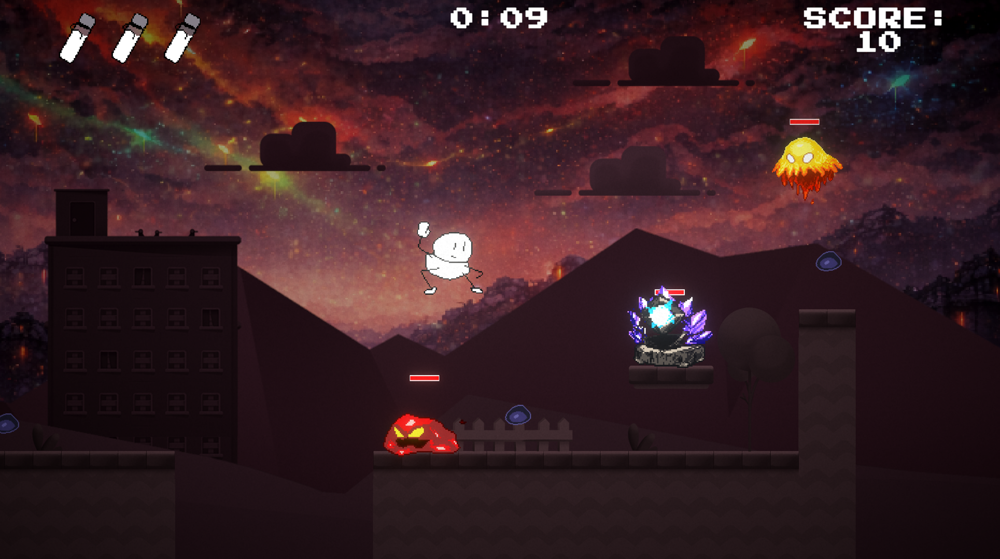
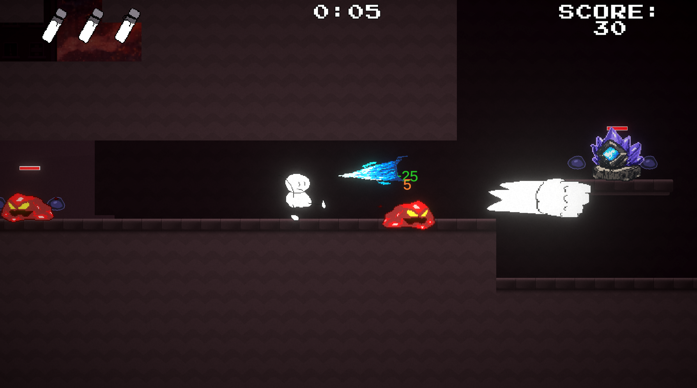
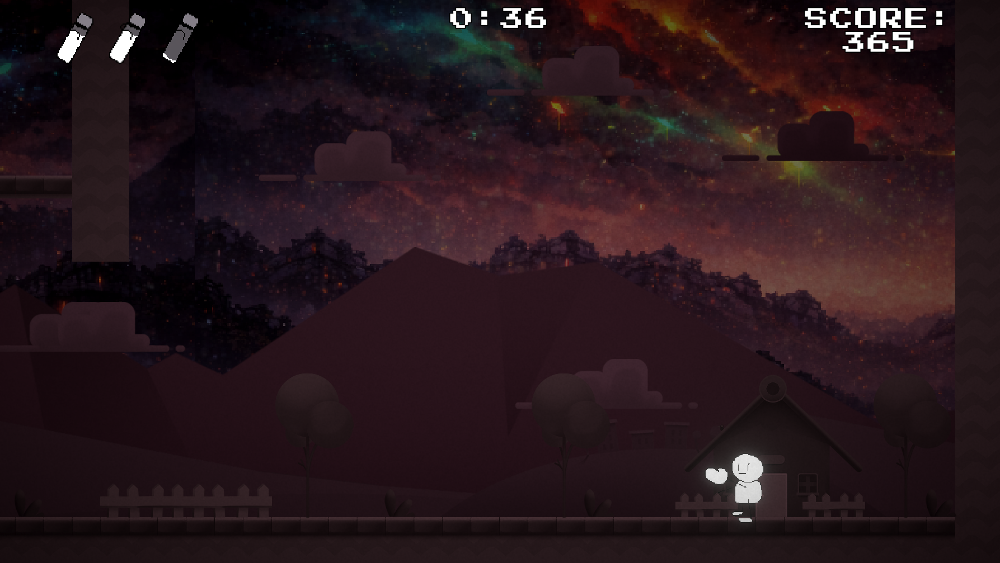
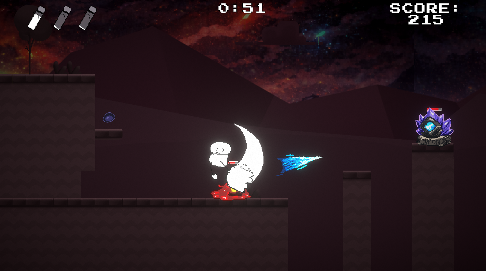
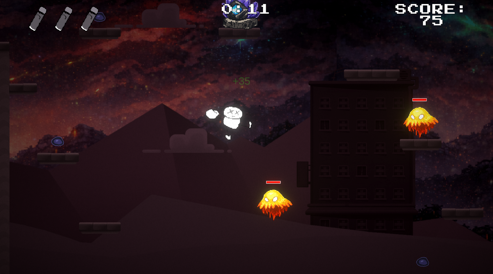
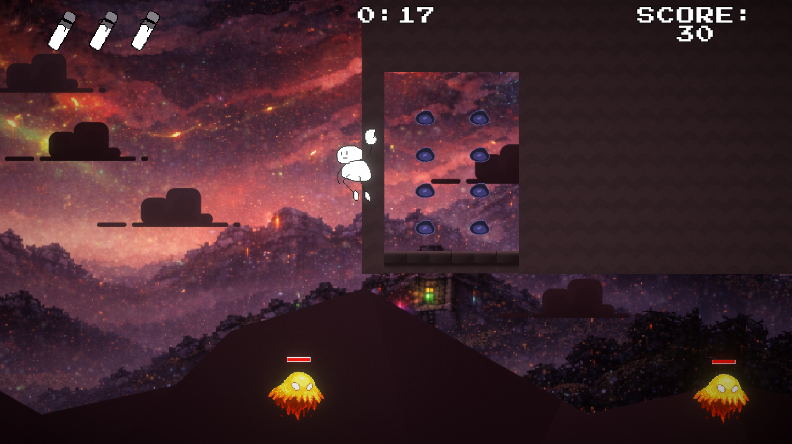
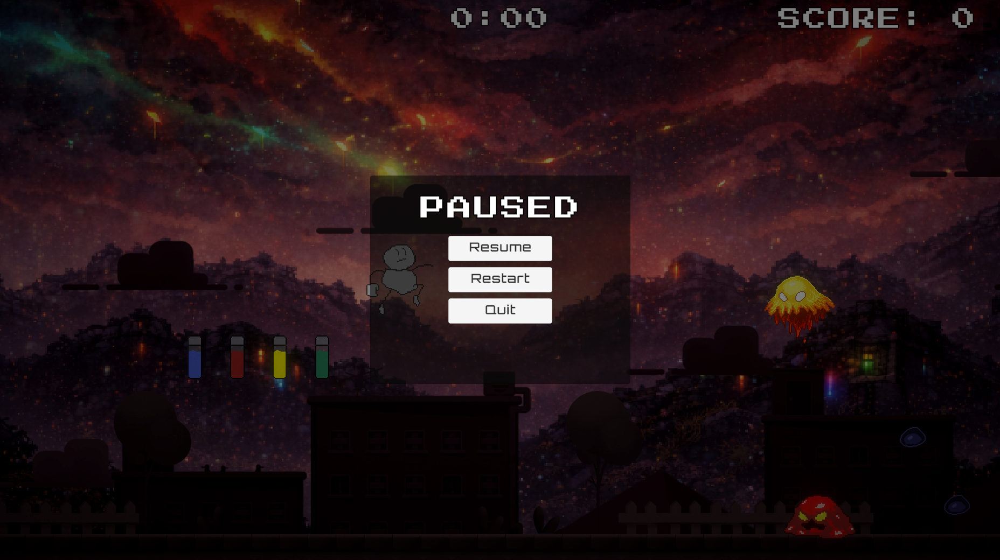

# Chromatic Cleanse

A 2D action platformer where color is the enemy.

## Concept

You are the last monochrome being in a world overrun by vibrant chaos. Armed with a comically large glove and advanced movement abilities, your mission is to eliminate all traces of color and... return home?

## Gameplay

**Combat:**

- 3-hit combo system with finisher attacks
- Aerial combat for vertical control
- Dodge roll with invincibility frames
- Each attack has unique range and damage

**Movement:**

- Double jump for extended air control
- Wall jump to climb any surface
- Roll dodge to phase through enemies
- Variable jump height (tap vs hold)

**Powerups:**
Colored vials grant temporary abilities based on their hue:

- **Green Vial:** Restores 1 health point
- **Yellow Vial:** Speed boost
- **Red Vial:** Damage boost
- **Purple Vial:** Slow time (oh yeah!)

Colors betray their purpose, use them wisely, then eliminate the source.

## Controls

- **Arrow Keys:** Move
- **Space:** Jump (hold for higher jumps)
- **A:** Attack
- **S:** Special ranged attack
- **Left Shift:** Roll

## Features

- HP system with visual feedback
- Invincibility frames with flash effect
- Enemy knockback and damage system
- Smooth camera follow
- Combo attack chains
- Advanced movement mechanics (wall jump, double jump, roll, air attack bounce)
- Parry to reflect enemy projectiles back at them
- Powerup timers and cooldown UI for key abilities
- Floating damage + score numbers and enemy health bars
- Time‑slow powerup visuals (ghost trail + screen tint)

## Screenshots

A few in‑engine moments that capture the tone and flow of the game.

## Credits

This game is for COSC 495 Introduction to Game Development course based on Unity's 2D Platformer Microgame template
Modified and extended with custom combat, movement, and powerup systems

---

*Restore the monochrome. Eliminate the color.*
